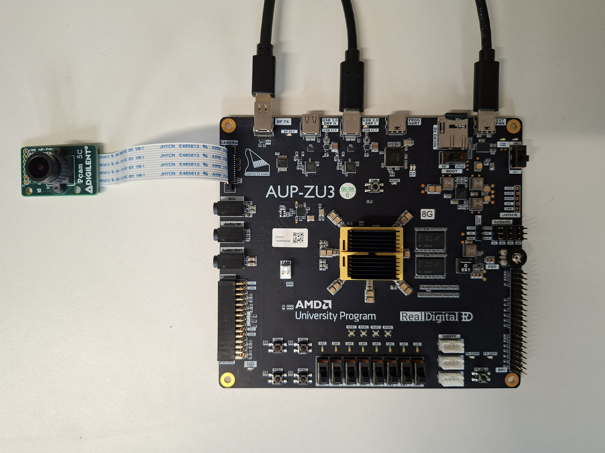
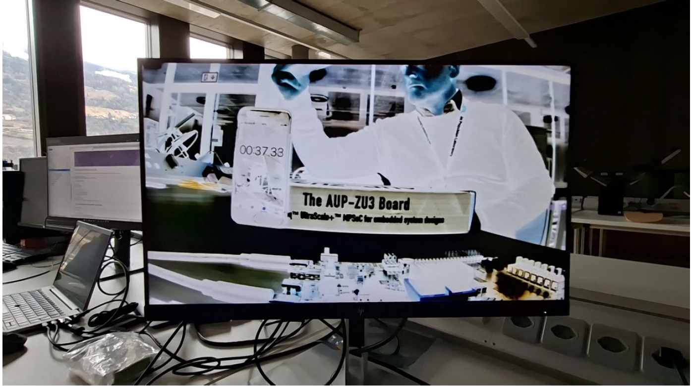

# DynaRapid-PYNQ-Video pipeline

## Description

This repository contains a set of files to test and generate single pixel video filters using DynaRapid for the PYNQ video pipeline, running on the AUP-ZU3 board.

### Reference design

This design is based on the base overlay provided with the AUP-ZU3 which can be found at [https://github.com/Xilinx/AUP-ZU3](https://github.com/Xilinx/AUP-ZU3). This design was however adapted to work with Vivado 2024.2 rather than 2024.1.


## Required Material

- Vivado 2024.2 (other versions might work, but not guaranteed)
- Java version capable of running DynaRapid (OpenJDK 11 works)
- [Digilent Pcam 5C Camera](https://reference.digilentinc.com/reference/add-ons/pcam-5c/start)
- External Display with a DisplayPort connection


## Quick Setup

This repository contains the files to generate a bistream as well as pre-compiled bitstreams ready to be tested on the AUP-ZU3 board. To test the pre-compiled bitstreams you can skip the step 3.

### Hardware Setup

Follow the instructions provided in [https://github.com/Xilinx/AUP-ZU3](https://github.com/Xilinx/AUP-ZU3). The hardware setup will look like the following one.



If you want to re-generate bitstreams on your machine, execute all steps below in order.

1. Project Setup
2. Filter Selection
3. Bitstream Generation
3. File Transfer to Board
4. Run Example on Board


## Steps

### 1. Project Setup

- Clone the repo with `git clone --recurse-submodules https://github.com/AGS-L/DynaRapid-PYNQ-Video-pipeline.git`
- Follow <https://xilinx.github.io/AUP-ZU3/getting_started.html> to set up the hardware

### 2. Filter Selection

In the folder [`pynq_base/base/filters/`](./pynq_base/base/filters/), you may select one of the following filters:

- `blue`: Isolates the blue color channel
- `green`: Isolates the green color channel
- `red`: Isolates the red color channel
- `negative`: Inverts the colors
- `passthrough`: No filtering; the video feed is passed through unchanged

### 3. Bitstream Generation

If you wish to regenerate a bitstream, you can run the following command to run the DynaRapid flow:

Windows:

```bat
run_generate_bitstream.bat <filterName>
```

For Windows only: Adapt the `VIVADO_INSTALL` variable in the `run_generate_bitstream.bat` script according to your setup.

Linux:

```sh
./run_generate_bitstream.sh <filter_name>
```

The argument `filter_name` specifies in which subfolder of [`pynq_base/base/filters/`](./pynq_base/base/filters/) to look for the DOT file `filter.dot`.

### 4. File Transfer to Board

A script is provided to easily transfer relevant files to the board. Once the board has booted, run the following command:

Windows:

```bat
send_files_2_board.bat <filter_name> <send_notebooks>
```

Linux:

```sh
./send_files_2_board.sh <filter_name> <send_notebooks>
```

After running this command you will be prompted for the password (`xilinx`).

The argument `filter_name` is what will be used in the python notebook to reference the bitstream. The example notebooks uses `passthrough` by default.

If you wish to send the notebook to the board (which you will need to do the first time), set the `send_notebooks` argument to `true`.

### 5. Run Example on Board

Open the [`dynarapid_single_pixel_filter.ipynb`](./pynq_base/base/notebook_examples/video/dynarapid_single_pixel_filter.ipynb) notebook on the board.

In the `Filter Selection` cell you can edit which filter you want to run. Execute the cells in the same order they are defined. If you don't have a DisplayPort monitor connected to the board, you can skip the cells related to the DisplayPort output.

### Example output

The figure illustrates the output produced by one of the filters (negative). The video pipeline operates at a frame rate of 30 fps, showing smooth and consistent processing of DynaRapid-generated video filter.




### Custom Filters

In [`c_code/src/filter.cpp`](./c_code/src/filter.cpp), you can find the C code used for generating a filter DOT file using dynamatic. If you want to add a custom DOT file, create a subfolder in [`pynq_base/base/filters/`](./pynq_base/base/filters/) with the desired name and place the DOT file into said folder.

If you decide to edit any of the existing filters or add a custom one, there is no guarantee the resulting filter will work.


## Work in Progress - Coming soon

### From Spec-to-Circuit - Interaction with Agentic AI

All filters were generated using publicly available generative AI tools. Ongoing work on generating such filters directly from English specifications (Spec-to-Circuit) has already been tested and will be released soon as part of this work [1]. Several work on agentic-AI interaction is currently in progress.

Please do not hesitate to get in touch in case you have any further interest on this feature.


### Convolutional Filters

Convolutional filters have already been developed and tested, and will be included in a forthcoming commit of this work.

Please do not hesitate to get in touch in case you have any further interest on this feature.


### Dynamic Partial Reconfiguration Support

A preliminary flow that includes the dynamic-partial reconfiguration has been already tested and is currently in development. 

Please do not hesitate to get in touch in case you have any further interest on this feature.


## Citation

If you would like to use this work, please cite the associated talks, papers, and demo presentations:

> 1. Andrea Guerrieri. *Redefining the FPGA Design Experience: What if EDA runtimes were no longer a problem?*. Domain-Specialized FPGAs, ISFPGA, Seaside, California, February 2026.


## Related Publications

> 2. Andrea Guerrieri, et al. *Compile in Seconds and Run on an FPGA with DynaRapid* 2025 35th International Conference on Field-Programmable Logic and Applications (FPL), Leiden, Netherlands, 2025, pp. 1-1, doi: https://doi.org/10.1109/FPL68686.2025.00068.

> 3. Andrea Guerrieri, et al. *Compile and Run on an FPGA with DynaRapid* The 33rd IEEE International Symposium on Field-Programmable Custom Computing Machines, Fayetteville, Arkansas, USA, May 2025. 

> 4. Andrea Guerrieri, et al.  *DynaRapid: Fast-Tracking from C to Routed Circuits* 2024 34th International Conference on Field-Programmable Logic and Applications (FPL), Torino, Italy, 2024, pp. 24-32, doi: https://doi.org/10.1109/FPL64840.2024.00014. **Best Paper Award**.

> 5. Andrea Guerrieri, et al. 2024. *DynaRapid: From C to FPGA in a Few Seconds*. In Proceedings of the 2024 ACM/SIGDA International Symposium on Field Programmable Gate Arrays (FPGA '24). Association for Computing Machinery, New York, NY, USA, 40. https://doi.org/10.1145/3626202.3637580

## Contact

For any question please feel free to reach out 

andrea.guerrieri@hevs.ch


## License

Copyright 2026 - Adaptive Heterogeneous Systems Lab, HES-SO University of Applied Sciences and Arts Western Switzerland, Engineering and Architecture Department

For any usage please see [LICENSE.txt](./LICENSE.txt).
